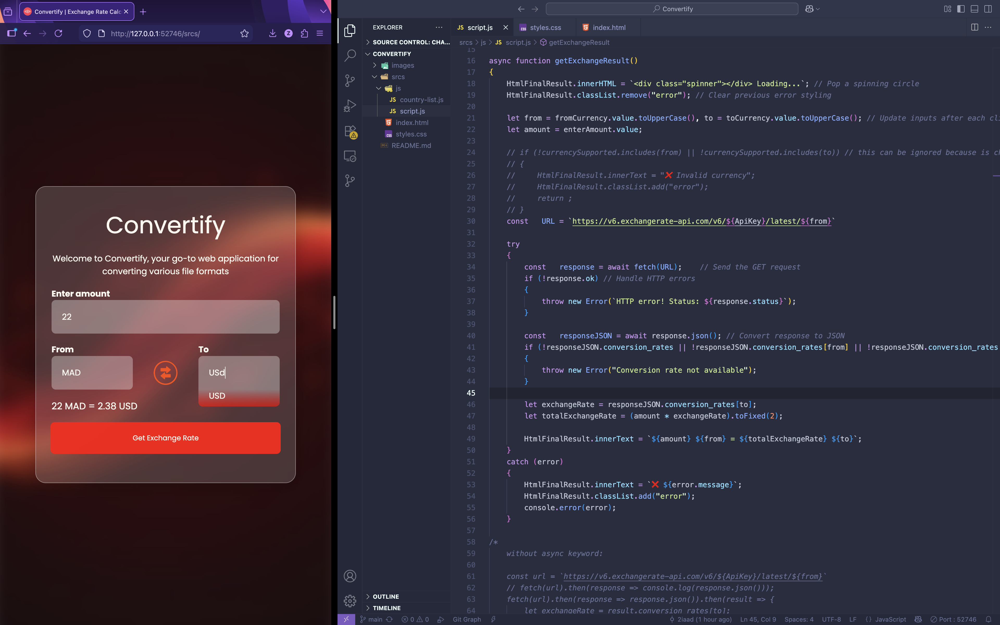

# 🌍 Convertify — Exchange Rate Calculator  
A simple, fast, and elegant web application to convert currencies in real-time using the ExchangeRate API.

Convertify was built as a learning project to practice:
- JavaScript (DOM, events, async/await, fetch)
- API requests
- CSS styling & UI/UX fundamentals
- Error handling & clean code structure

---

## 🖼️ Preview  


---

# 🚀 Features

### ✅ Real-time currency conversion  
Uses live data from **ExchangeRate-API** through `fetch()` and `async/await`.

### ⚡ Live suggestions (autocomplete)  
Typing `"U"` instantly suggests `"USD"` or any matching currency.

### 🔄 Currency Switch Button  
Swap From/To currencies with one click.

### ⏳ Loading Spinner  
Shows a loading animation while fetching data.

### ❗ Inline Error Messages  
Displays errors directly in the UI (e.g., invalid currency).

### 🎨 Glassmorphism UI  
A modern blurred-card look using CSS `backdrop-filter`.

### 🎯 Smooth animations  
Buttons and hover interactions feel responsive & polished.

---

# 🛠️ Tech Stack  

| Technology | Purpose |
|-----------|---------|
| **HTML** | Page structure |
| **CSS** | Styling (glassmorphism, animations, gradients) |
| **JavaScript** | Logic, API calls, autocomplete, DOM |
| **ExchangeRate API** | Fetching live exchange data |

---

# Work Flow

```
         ┌──────────────────┐
         │   User inputs    │
         │ amount/currencies│
         └─────────┬────────┘
                   │
                   ▼
         ┌────────────────────┐
         │   Validate input   │
         └─────┬──────────────┘
               │ valid?
       ┌───────┴───────────┐
       │                   │
      NO▼                  YES▼
┌──────────────┐    ┌──────────────────────┐
│  Show error  │    │ Fetch exchange rate  │
└──────────────┘    │ (async/await fetch())│
                    └───────────┬──────────┘
                                │
                                ▼
                    ┌────────────────────────┐
                    │ Compute final result    │
                    │ amount * conversionRate│
                    └───────────┬────────────┘
                                │
                                ▼
                    ┌────────────────────────┐
                    │ Display output in UI   │
                    └────────────────────────┘
```
# What I Learned From This Project ?

-> How to communicate with APIs

-> How to use async/await properly

-> DOM manipulation and event listeners

-> Adding UI feedback (spinners, suggestions, errors)

-> Improving UX with simple touches

-> Git and GitHub workflows

-> Clean code organization